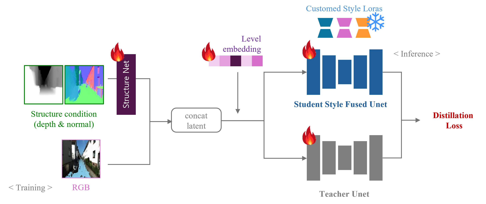

<h1 align="center">FSCM-Diffusion: Stepwise Control of Climate Phenomena using Fused Structural Condition Maps</h1>

**FSCM-Diffusion** is a diffusion-based image editing framework that enables explicit, fine-grained, and physically plausible control over flooding in real-world scenes.  
Unlike prior methods that struggle with structural consistency or lack quantitative interpretability, we introduce a **Leveling System** that encodes user-specified water instructions as discrete numeric values, allowing precise and consistent modulation.

To enhance realism and geometric coherence, we propose a **Fused Structural Condition Map (FSCM)** that integrates depth and surface normal maps as conditioning inputs.  
This fused representation guides the generation to better conform to underlying scene geometry and fluid dynamics, mitigating artifacts like surface misalignment or texture blur.

We further incorporate a custom **Style-LoRA**, distilled from limited data, to inject localized rainfall and snowfall textures without requiring large-scale style datasets, enhancing stylistic fidelity and visual diversity.

For training and evaluation, we construct a high-quality paired dataset combining **synthetic Climate-NeRF renderings** with **temporally aligned real-world YouTube footage** depicting progressive flood scenarios.  
Our method generalizes well to in-the-wild images, producing visually coherent edits across diverse urban and natural environments.  
Quantitative metrics and human evaluations confirm that FSCM-Diffusion outperforms existing approaches in generating structure-preserving, intensity-controlled climate transformations.

This framework opens new possibilities for disaster simulation, climate-aware urban planning, and temporally consistent visual effects generation.

---


## 🌟 Features
- Fused Structural Condition Map (FSCM)
- Level-based flood/snow control
- Style-LoRA integration

---

## 🚀 Quick Demo

### 🔹 Step 1: Input (Image + FSCM + Level)

The model takes an RGB input image, a depth map, a surface normal map, and a level instruction to control the intensity of flooding or snowfall.

```bash
python inference.py \
  --input_image assets/demo_input.jpg \
  --depth_map assets/demo_depth.png \
  --normal_map assets/demo_normal.png \
  --level 3 \
  --output_dir outputs/demo/
```

### 🔹 Step 2: Output (Level 3 - More Flooded)
```
Below is the result generated by FSCM-Diffusion with `level 3`, corresponding to a moderate increase in flooding intensity.


```

### 🔹 Step 3: Comparison by Levels
---

The following shows the results of applying different intensity levels from 1 to 5.  
As the level increases, more of the scene becomes submerged.

| Level 1 | Level 3 | Level 5 |
|:--:|:--:|:--:|
|  |  |  |

> 💡 Levels are discrete numeric indicators (0–5) representing climate severity.

---

## 📁 Model Pipeline



---

## 📁 Ablation Study

  


---

## 📄 Citation

If you find this work helpful, please consider citing:

```bibtex
@inproceedings{fscm_diffusion_2025,
  title     = {FSCM-Diffusion: Stepwise Control of Climate Phenomena using Fused Structural Condition Maps},
  author    = {Your Name and Collaborators},
  booktitle = {NeurIPS},
  year      = {2025}
}
